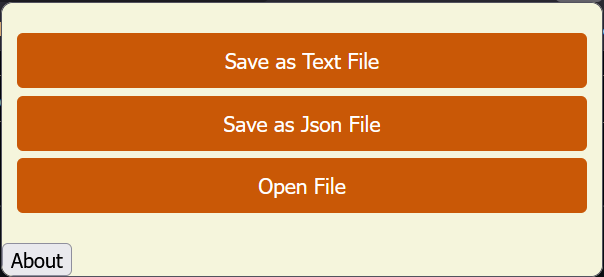

# An Extension that Saves and Opens Tabs

Available for Chrome and Firefox.

Clone or download to get started.


## Deployment/Run Locally


To deploy this project in Firefox 

```
  Open the "about:debugging" page by typing it into the search bar and click the "This Firefox" option.
  Then click the "Load Temporary Add-on" button, then select the manifest.json file.
  
  The extension now installs, and remains installed until you restart Firefox.
  
  Note: By default extensions don't work in private browsing. If you want to use this extension in private browsing,
  open the "about:addons" page, click on the extension, and select the "Allow" for Run in Private Windows.
```

To deploy this project in Chrome

```
    Load an unpacked extension in developer mode:

    Go to the Extensions page by entering chrome://extensions in a new tab.
        - Alternatively, click the Extensions menu puzzle button and select Manage Extensions at the bottom of the menu.
        - Or, click the Chrome menu, hover over More Tools, then select Extensions.
    Enable Developer Mode by clicking the toggle switch next to Developer mode.
    Click the Load unpacked button and select the extension directory. 
```

## Screenshots




## Roadmap

- Add to store to allow non-local deployment

- Add About description

